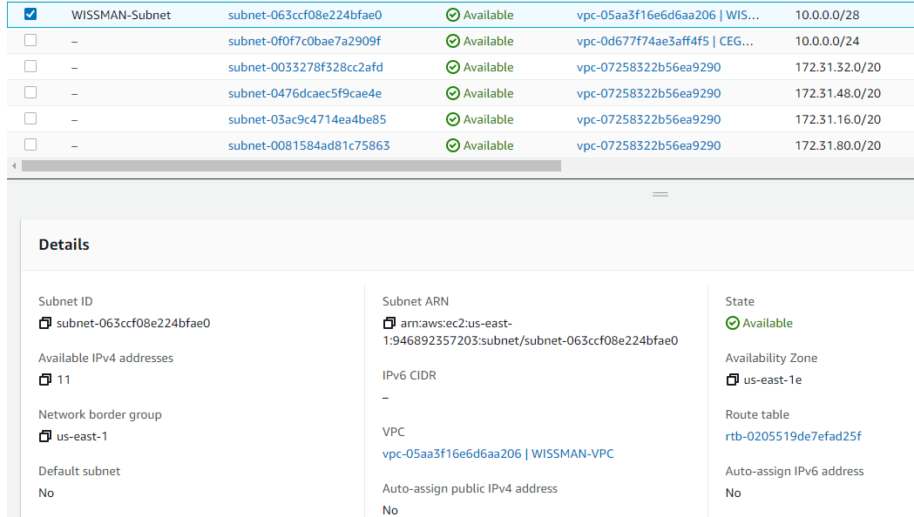
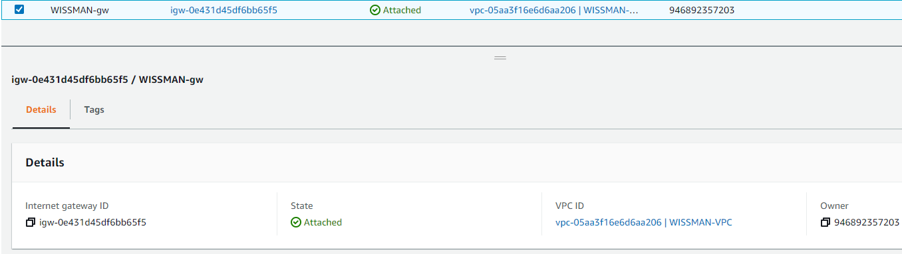
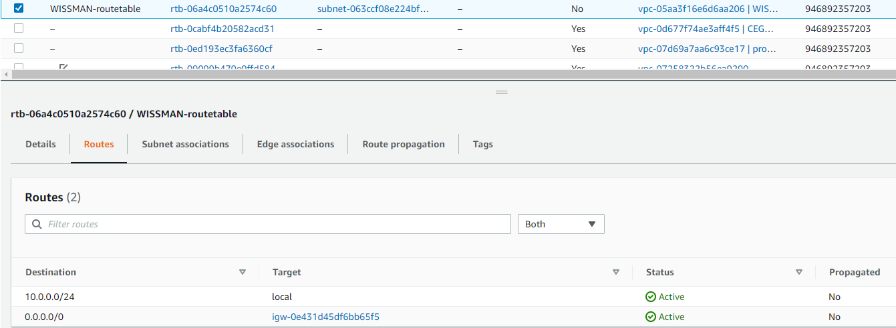
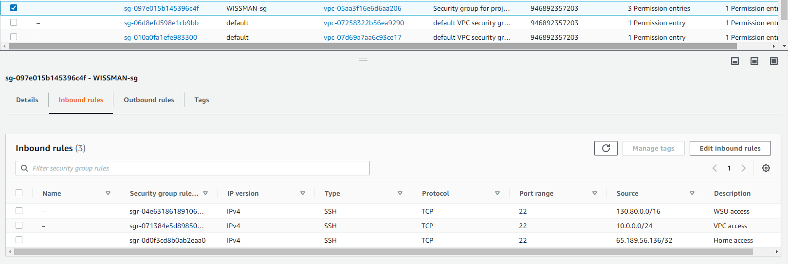
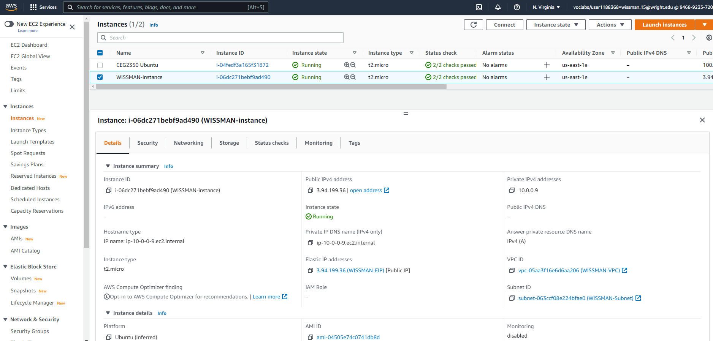
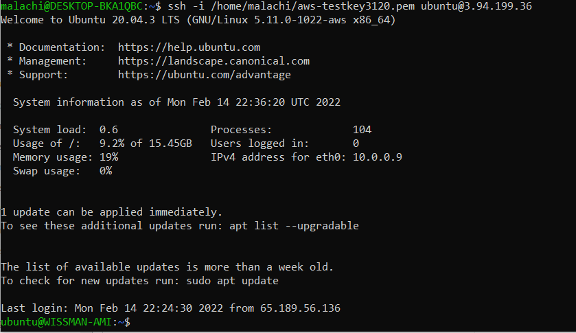

PART 1

1. Create a VPC
	- This can be used to run code, store date, host websites or anything a cloud could do. It is hosted remotely by Amazon or AWS and it paid for.
	-  
2. Create a subnet
	- This is a peice of a larger network and can be used to divide large networks into smaller ones. We helped our vpc by setting the traffic so it can travel a shorted distance.
	- 
3. Create an internet gateway
	- This can transfer communications between an enterprise network and the internet. We used it to provice a target in our VPC route tables for internet traffic.
	-  
4. Create a route table
	- This is used to keep track of paths and determine which way to forward traffic. We used it exactly for this in our VPC to control where traffic goes.
	- 
5. Create a security group
	- This is basically a virtual firewall for incomming and outgoing traffic. We used it to setup inbound rules for our VPC.
	- 
PART 2

1. Create a new instance. 
	- I selected the ubuntu 20 AMI
		- Default Username: ubuntu
	- Ubuntu 20
2. Attach the instance to my VPC.
	- in configure instance for network I selected my VPC
3. Determine wheather a Public IPv4 address will be auto-assigned.
	- i decided to disable auto-assign to prevent amazon from potential swiping it from me. I will jsut be creating my own IPv4 to be used.
4. Attach a volume to your instance.
	- I choose my storage during the instance setup and i choose general purpose SSD with a size of 16GB.
5. Tag your instance with a "name".
	- I did this in the add tags part of the instance setup and made the key "name" and the Value "WISSMAN-instance" like instructed.
6. Associate your security group.
	- I did this in the Configure security group part of the instance setup and chose my previously made security group for the VPC as the wanted security group.
7. Reserve and Elastic IP address.
	- I did this by going to Elastic Ip in EC2 and clicking Allocate Elastic IP address and taging it the approciate tag required.
	- I then associated it with the instance by clicking the actions tab and associating elastic ip address with my new instance.
8. 
9. I changed the host name of my new instance with this command "sudo hostnamectl set-hostname WISSMAN-AMI" and then rebooted the instance for changes to take effect.
10.  
